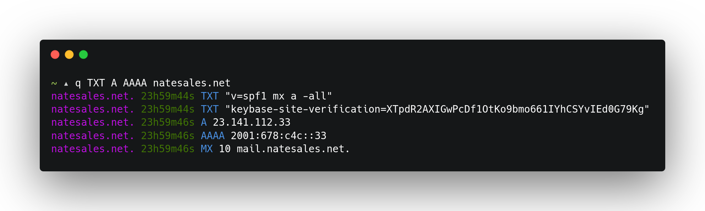

<div align="center">
<h1>q</h1>

A tiny command line DNS client with support for UDP, DoT, DoH, DoQ, and ODoH.

[](https://github.com/natesales/q/releases)

[](https://goreportcard.com/report/github.com/natesales/q)
[](https://raw.githubusercontent.com/natesales/q/main/LICENSE)


</div>

### Usage
```
q command line DNS client (https://github.com/natesales/q)

Usage:
  q [OPTIONS]

Application Options:
  -q, --qname=      Query name
  -s, --server=     DNS server
  -t, --type=       RR type
  -x, --reverse     Reverse lookup
  -d, --dnssec      Request DNSSEC
  -f, --format=     Output format (pretty, json, raw) (default: pretty)
  -c, --chaos       Use CHAOS query class
  -p, --odoh-proxy= ODoH proxy
  -i, --insecure    Disable TLS certificate verification
      --timeout=    Upstream timeout in seconds (default: 10)
  -v, --verbose     Show verbose log messages

Help Options:
  -h, --help        Show this help message
```

### Demo

[](https://asciinema.org/a/XdWPPvZgx4hEBFwGnGwL13bsZ)

### Protocol Support
- UDP DNS ([RFC 1034](https://tools.ietf.org/html/rfc1034))
- DNS over TLS ([RFC 7858](https://tools.ietf.org/html/rfc7858))
- DNS over HTTPS ([RFC 8484](https://tools.ietf.org/html/rfc8484))
- DNS over QUIC ([draft-ietf-dprive-dnsoquic-02](https://tools.ietf.org/html/draft-ietf-dprive-dnsoquic-02))
- Oblivious DNS over HTTPS ([draft-pauly-dprive-oblivious-doh-06](https://tools.ietf.org/html/draft-pauly-dprive-oblivious-doh-06))

### Installation
`q` is available as a deb/rpm for apt/yum in my [public code repositories](https://github.com/natesales/repo), as a binary under [releases](https://github.com/natesales/q/releases), and in the AUR as [q-dns-git](https://aur.archlinux.org/packages/q-dns-git/).
